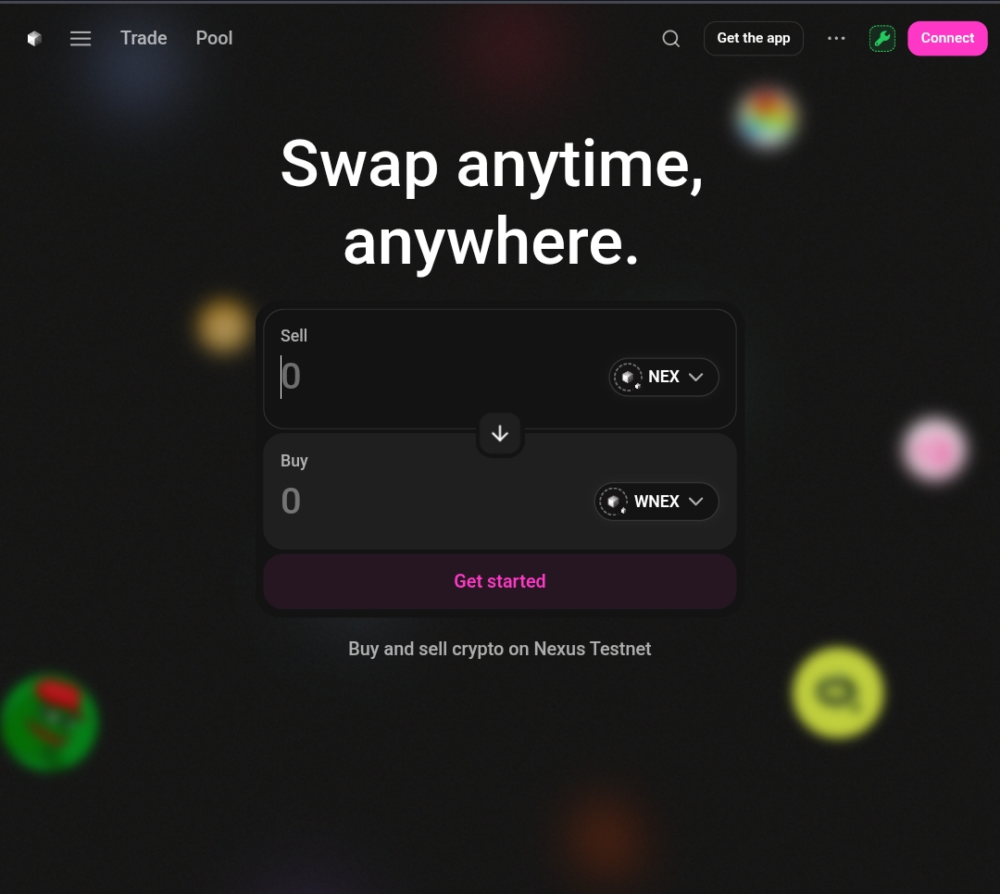
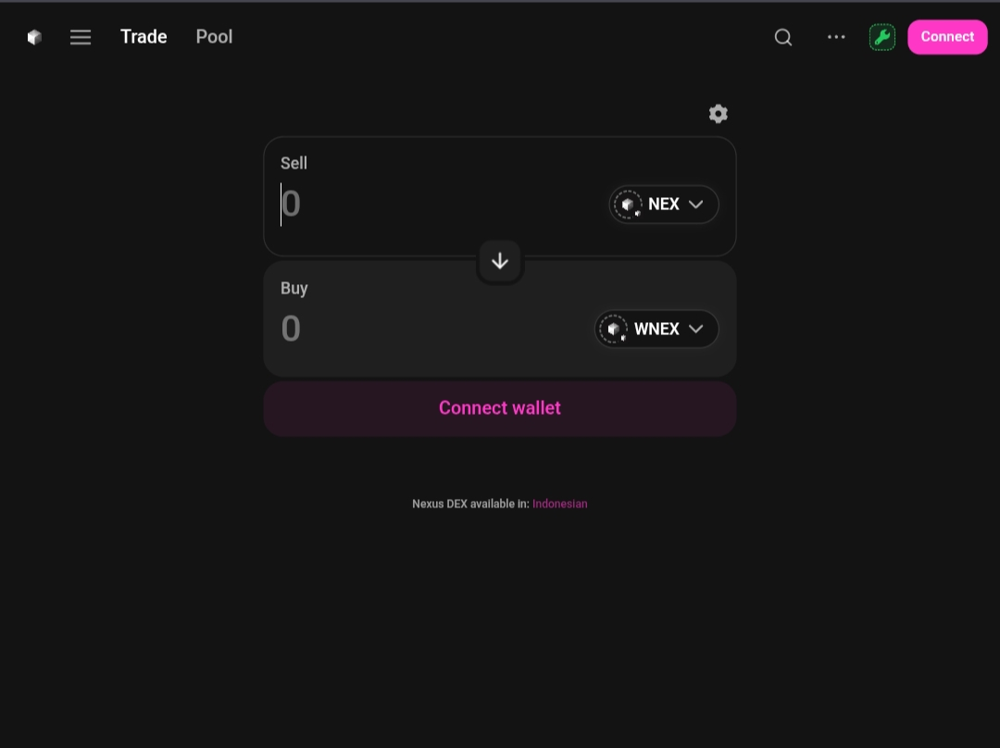
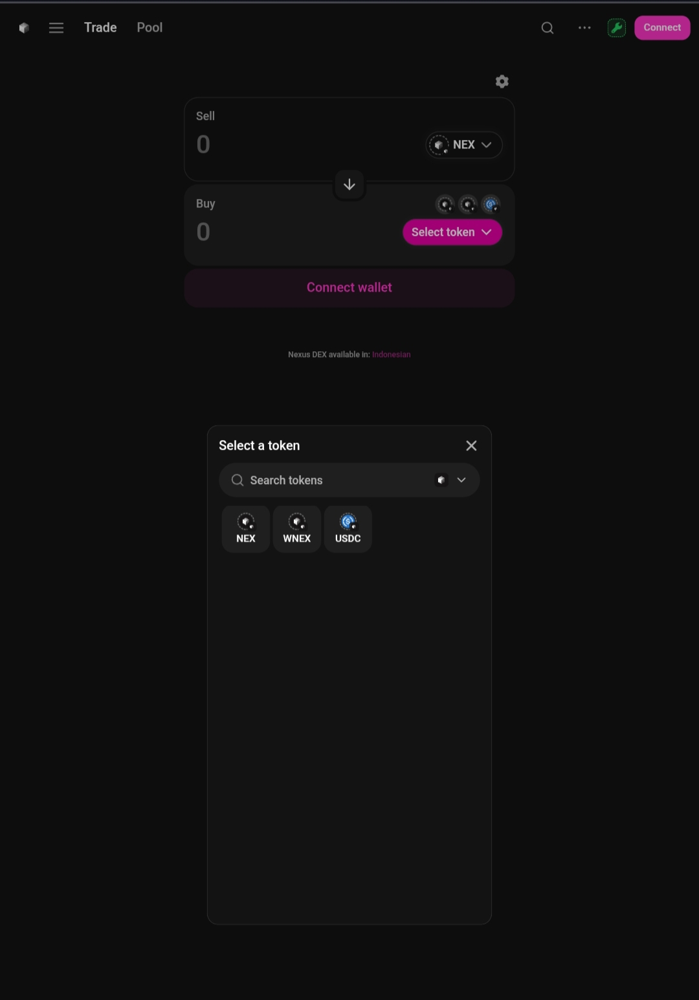

# Nexus DEX

A decentralized exchange interface built for Nexus Testnet. This project provides a modern, user-friendly trading experience with support for token swaps, liquidity pools, and position management.

## Live Demo

**Production:** [https://nexus-dex.vercel.app](https://web-gx72dyzfs-deniardis-projects-abe78544.vercel.app)

## Overview

Nexus DEX is a frontend interface that connects to Uniswap V3 smart contracts deployed on Nexus Testnet (Chain ID: 3945). The interface has been customized with Nexus branding and optimized for the Nexus blockchain ecosystem.

## Features

- **Token Swap** - Exchange tokens with real-time price quotes from on-chain QuoterV2
- **Wrap/Unwrap** - Convert native NEX to WNEX and vice versa
- **Liquidity Pools** - Create and manage V3 liquidity positions
- **Position Management** - View, increase, or remove liquidity from existing positions
- **Multi-language Support** - Available in 15+ languages including English and Indonesian
- **Mobile Responsive** - Works on desktop browsers and mobile dApp browsers (MetaMask, OKX)

## Tech Stack

- React 18
- TypeScript
- Vite
- Redux Toolkit
- Ethers.js
- Tamagui (UI Components)
- React Query

## Network Configuration

| Property | Value |
|----------|-------|
| Network Name | Nexus Testnet |
| Chain ID | 3945 |
| RPC URL | https://rpc.nexus.testnet.rollup.cc |
| Block Explorer | https://explorer.nexus.testnet.rollup.cc |
| Native Token | NEX |

## Core Contracts

All contracts are deployed on Nexus Testnet:

| Contract | Address |
|----------|---------|
| SwapRouter | `0xf96e9bf8fddf64534f9ed45a0696d02f490d0197` |
| QuoterV2 | `0x6878b5c4564f61f2d1b4d336853a211f0e0cfa11` |
| NonfungiblePositionManager | `0x643770e279d5d0733f21d6dc03a8efbabeb3e21e` |
| WNEX (Wrapped NEX) | `0x11cbb81b69f6a7024ace3c83a14eb87e8c540879` |
| USDC | `0x8586bac6d1d34df58bad5a7aceb95cc7a9e02552` |

## Project Structure

```
Nexus-DEX/
├── src/
│   ├── components/       # UI component examples
│   ├── config/          # Chain and token configuration
│   └── assets/          # Logo and brand assets
├── screenshots/         # Interface screenshots
├── README.md
└── LICENSE
```

## Screenshots

### Landing Page


### Swap / Wrap Interface


### Token Selector


### Positions Page


## Key Customizations

1. **Chain Integration** - Native support for Nexus Testnet with proper RPC configuration
2. **Token Registry** - Pre-configured common tokens (NEX, WNEX, USDC)
3. **Branding** - Custom logo, colors, and naming throughout the interface
4. **Localization** - Updated translations for Nexus DEX branding

## Development Notes

This is a showcase repository containing selected components and configurations from the full project. The complete working version is deployed at the demo link above.

Key files that were modified from the base Uniswap interface:
- Chain configuration for Nexus Testnet
- Token definitions and addresses
- Swap service for on-chain quotes via QuoterV2
- UI branding and translations

## Building Your Own

If you want to deploy a similar DEX on your own network:

1. Deploy Uniswap V3 contracts to your chain
2. Configure chain info (RPC, chain ID, explorer)
3. Set up wrapped native token address
4. Add your token registry
5. Update branding assets and translations

## Contributing

Contributions are welcome. Feel free to open issues or submit pull requests.

## Author

**Deni**
- X (Twitter): [@DBzhx7955](https://x.com/DBzhx7955)

## License

MIT License - see [LICENSE](LICENSE) for details.

## Disclaimer

This software is provided "as is" without warranty of any kind. Use at your own risk. This is a testnet application and should not be used with real funds.
